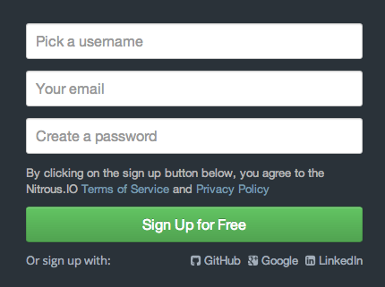
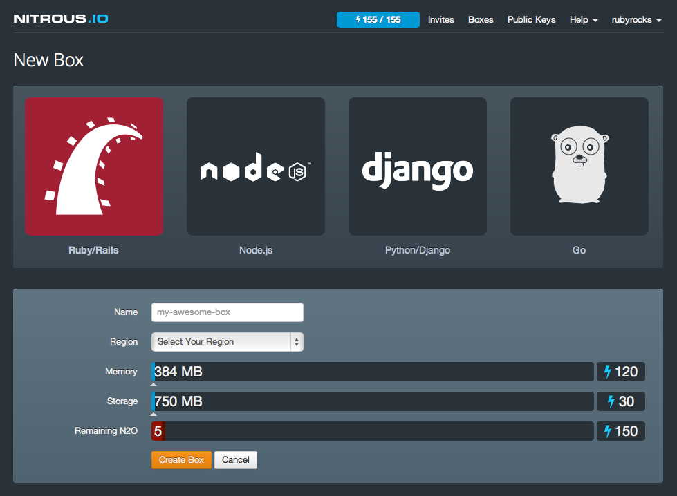
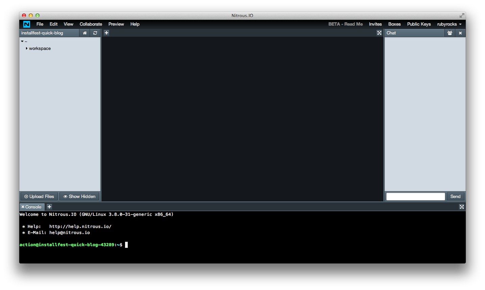

## What is Nitrous ?
[nitrous.io](http://nitrous.io) is a cloud-based development environment.
It leverages all the powerful concepts of the cloud to provide you with a completly encapsulated environment.
In a few clics, you have access to an online server, set up so you can code in your language of choice.
It has a full web IDE, you can browse the filesystem, edit files and access a shell console, all this via a single browser window, regardless of your machine OS, softwares or general state.

It is still in Beta, but it's very promising, and completly functionnal for our tutorials.

## Signing Up
As most modern web product, signing-up is easy and free.

- Head to [http://nitrous.io](http://nitrous.io)
- Fill in your customary **username**, **email** and **password**
  Alternatively, you can sign up with your GitHub, Google or LinkedIn account
- Confirm your email address by clicing the link they will send you instantly

You will land on a short introduction page. You can mostly skip it.

That's it, you can create your box, now. 

## Creating a box
Once logged in, you land on the box management page [nitrous.io/app](https://www.nitrous.io/app).
Clic on **New Box**

- You can choose your environment, the default one should be Ruby/Rails (conveniently)
- Next you will need a name. It can be pretty much anything (use only a-z, 0-9, and hyphen(-), can't start with hyphen or digits, can't end with hyphen, though)
If you lack inspiration, go for `installfest-quick-blog`
- Choose the region that is the closest to you. If you are in Sydney, set `Oceania`
- Leave the other settings to their defaults (which are the minimum values, perfect for a free development box)

Last, clic **Create Box**.
Nitrous will provision your box (it should only last a few seconds) and redirect you to your web IDE.

## The web IDE (finding your way around)
Nitrous offers many ways to interact and code on your box.
The default one is through their web IDE.

It's simple but has all that's needed:
- A filesystem browser (column on the left)
- A text editor (central column)
- A console (bottom row)
- A chat for team coding (column on the right)

You probably won't need the chat, so you can close its pane to reclaim screen real estate.

The editor pane and console pane are tabbed, meaning you can open several files or console session at the same time, and they can both be toggled to full screen.

## Setting up Git (on the box)
Further down the road, we will rely on Git to handle our versioning.
Let's set it up on our box.
It is already installed, we just need to run two commands in the console to configure it properly:

    git config --global user.email “(your git email)”
    git config --global user.name “(your git username)”    

_These setting are only there to associate commit with a person,
you are not signing up for any service._

## Now Go On And Start Coding
You're all setup, you can now proceed onto the creation of your first Rails app:
**[Get Started](/guides/installfest_4/getting_started)**

## A Little Further With Nitrous…

### Bonus for Mac Users (Nitrous/mac)
If you work on a Mac, with at least Mac OS X 10.7,
you can work locally with your favourite text editor and sync with your box.
You will need to download an app: [nitrous.io/mac](https://www.nitrous.io/mac)
and see further informations here: [help.nitrous.io/mac-preferences](http://help.nitrous.io/mac-preferences/)

### Bonus for Advanced Coders
If you prefer to code n your local console, ie. in Vim or Emac,
you can SSH into your box.

First, setup your SSH keys as explained here:
[Nitrous SSH Keys settings](http://help.nitrous.io/ssh-add/)

Then, find the SSH URI for your box on your [Nitrous dashboard](https://www.nitrous.io/app).

